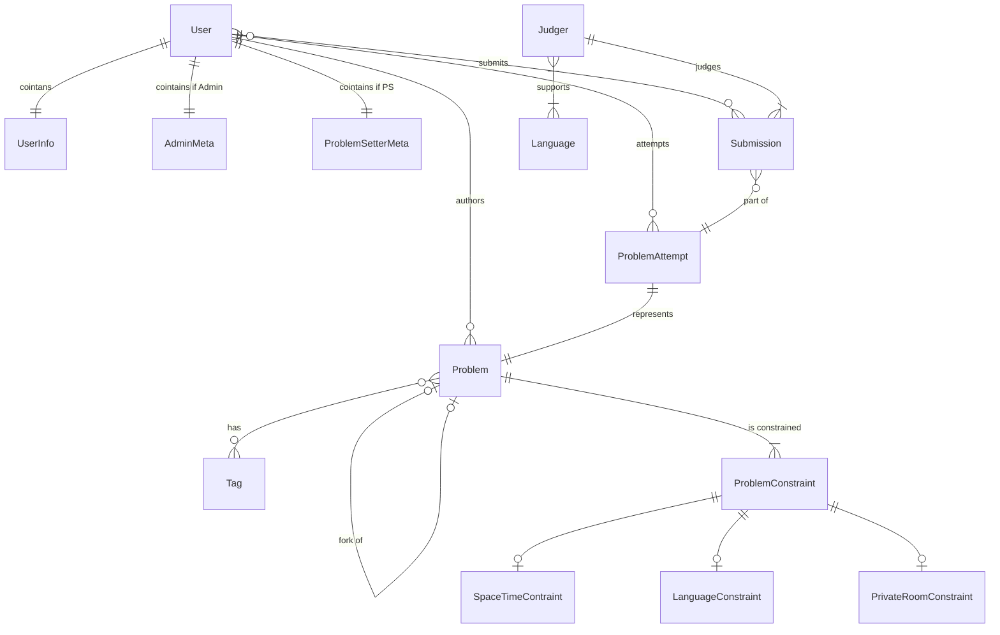

```mermaid
erDiagram
    User ||--|| UserInfo : cointans
    User ||--|| AdminMeta : "cointains if Admin"
    User ||--|| ProblemSetterMeta : "cointains if PS"
    User ||--o{ Problem : "authors"
    User ||--o{ ProblemAttempt : "attempts"
    User }o--o{ Submission : "submits"
    ProblemAttempt ||--|| Problem : "represents"
    Submission }o--|| ProblemAttempt : "part of"
    Problem |o--o| Problem : "fork of"
    Problem }o--o{ Tag : "has"
    Judger ||--|{ Submission : "judges"
    Judger }|--|{ Language : "supports"
    Problem ||--|{ ProblemConstraint : "is constrained"
    ProblemConstraint ||--o| SpaceTimeContraint : ""
    ProblemConstraint ||--o| LanguageConstraint : ""
    ProblemConstraint ||--o| PrivateRoomConstraint : ""
```