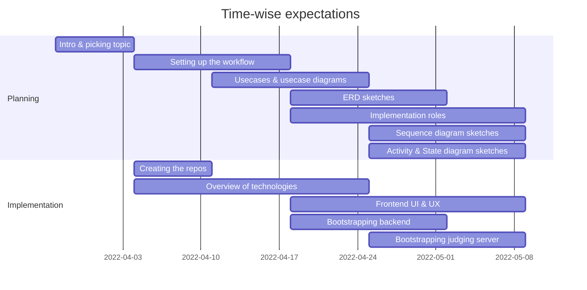

```mermaid
gantt
    title Time-wise expectations
    dateFormat  YYYY-MM-DD
    section Planning
    Intro & picking topic           :2022-03-28, 7d
    Setting up the workflow         :2022-04-04, 14d 
    Usecases & usecase diagrams     :2022-04-11, 14d 
    ERD sketches                    :2022-04-18, 14d
    Implementation roles            :2022-04-18, 21d
    Sequence diagram sketches       :2022-04-25, 14d
    Activity & State diagram sketches :2022-04-25, 14d

    section Implementation
    Creating the repos               :2022-04-04, 7d
    Overview of technologies         :2022-04-04, 21d
    Frontend UI & UX                 :2022-04-18, 21d
    Bootstrapping backend            :2022-04-18, 14d 
    Bootstrapping judging server     :2022-04-25, 14d
```

~~besa the best has taken over xD~~
under control

***the woman was too stunned to speak***   
switch computers **DONE**
 
wohooooskjakf'a
yaya this is so much fun 
wohoow yaay

birds and the bees
