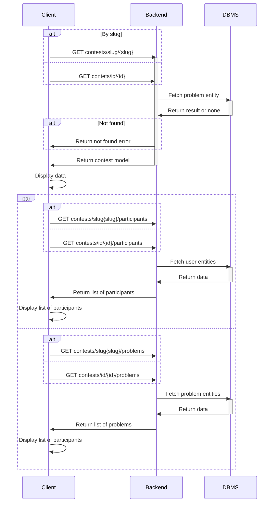

```mermaid
sequenceDiagram
    participant Client
    participant Backend
    participant DBMS

    activate Client
    alt By slug
        Client->>Backend: GET contests/slug/{slug}
        activate Backend
    else
        Client->>Backend: GET contets/id/{id}
    end

    Backend->>DBMS: Fetch problem entity
    activate DBMS
    DBMS->>Backend: Return result or none
    deactivate DBMS

    alt Not found
        Backend->>Client: Return not found error
    end

    Backend->>Client: Return contest model
    deactivate Backend

    Client->>Client: Display data
    par
        alt
            Client->>Backend: GET contests/slug{slug}/participants
        else
            Client->>Backend: GET contests/id/{id}/participants
        end

        Backend->>DBMS: Fetch user entities
        activate DBMS
        DBMS->>Backend: Return data
        deactivate DBMS

        Backend->>Client: Return list of participants

        Client->>Client: Display list of participants
    and
        alt
            Client->>Backend: GET contests/slug{slug}/problems
        else
            Client->>Backend: GET contests/id/{id}/problems
        end

        Backend->>DBMS: Fetch problem entities
        activate DBMS
        DBMS->>Backend: Return data
        deactivate DBMS

        Backend->>Client: Return list of problems
        Client->>Client: Display list of participants
    end
```