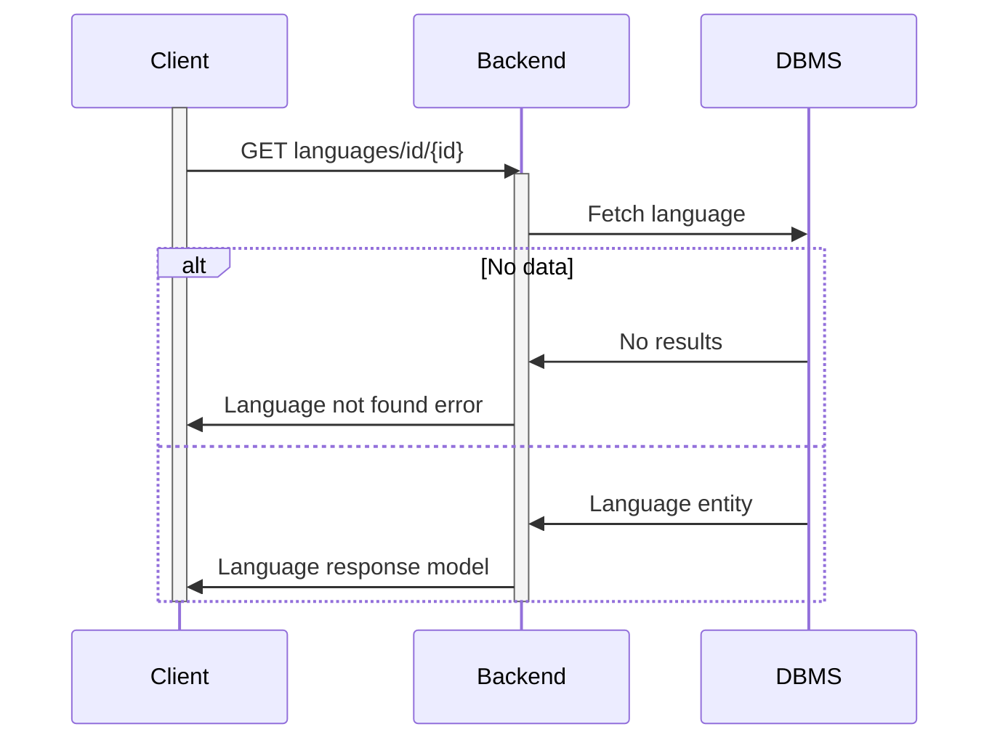

```mermaid
sequenceDiagram
    participant Client
    participant Backend
    participant DBMS

    activate Client
    Client->>Backend: GET languages/id/{id}
    activate Backend
    Backend->>DBMS: Fetch language
    alt No data
        DBMS->>Backend: No results
        Backend->>Client: Language not found error
    else
        DBMS->>Backend: Language entity
        Backend->>Client: Language response model
    end
    deactivate Backend
    deactivate Client
```