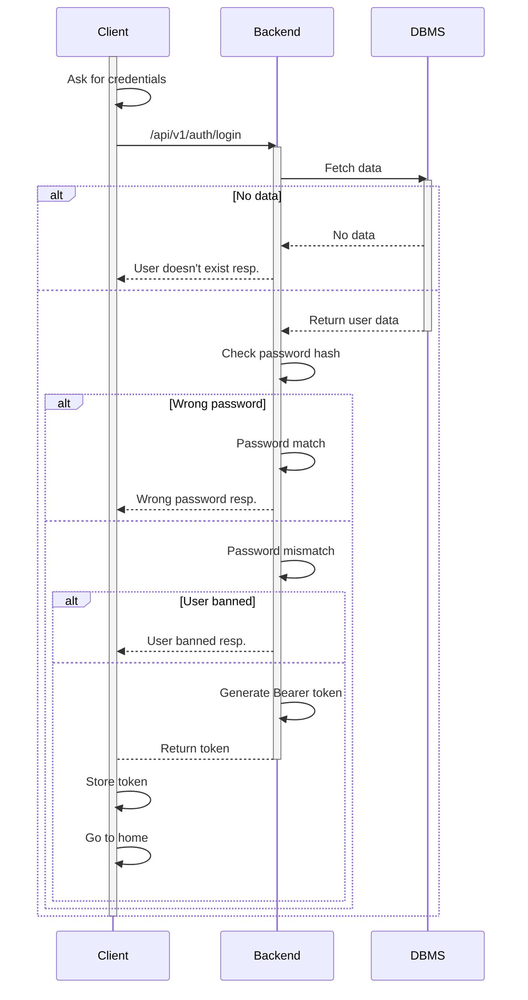

```mermaid
sequenceDiagram
    participant Client
    participant Backend
    participant DBMS
    activate Client
    Client->>Client: Ask for credentials
    Client->>Backend: /api/v1/auth/login
    activate Backend
    Backend->>DBMS: Fetch data
    activate DBMS
    alt No data
        DBMS-->>Backend: No data
        Backend-->>Client: User doesn't exist resp.
    else
        DBMS-->>Backend: Return user data
        deactivate DBMS
        Backend->>Backend: Check password hash

        alt Wrong password
            Backend->>Backend: Password match
            Backend-->>Client: Wrong password resp.
        else
            Backend->>Backend: Password mismatch
            alt User banned
                Backend-->>Client: User banned resp.
            else
                Backend->>Backend: Generate Bearer token
                Backend-->Client: Return token
                deactivate Backend
                Client->>Client: Store token
                Client->>Client: Go to home
            end
        end
    end
    deactivate Client
```