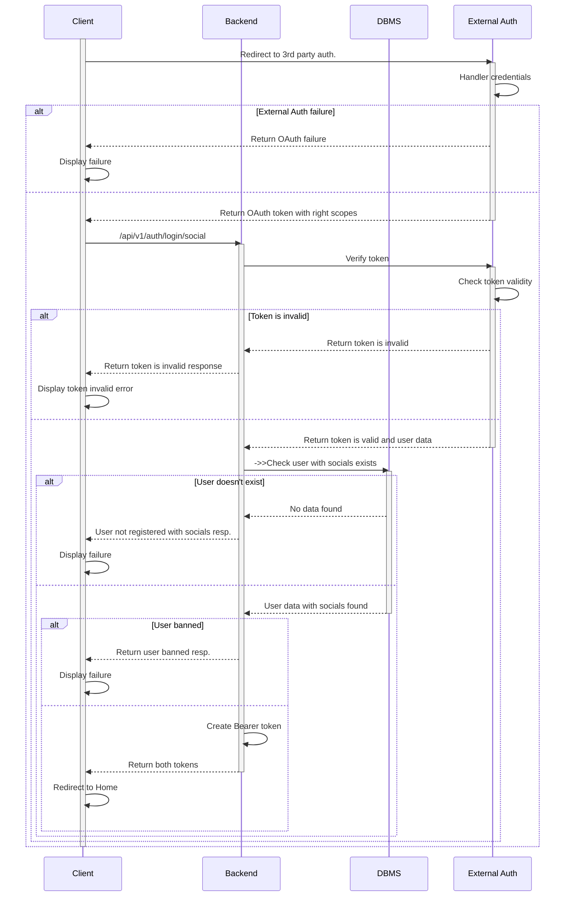

```mermaid
sequenceDiagram
    participant Client
    participant Backend
    participant DBMS
    participant External Auth
    activate Client
    Client->>External Auth: Redirect to 3rd party auth.
    activate External Auth
    External Auth->>External Auth: Handler credentials
    alt External Auth failure
        External Auth-->>Client: Return OAuth failure
        Client->>Client: Display failure
    else
        External Auth-->>Client: Return OAuth token with right scopes
        deactivate External Auth
        Client->>Backend: /api/v1/auth/login/social
        activate Backend
        Backend->>External Auth: Verify token
        activate External Auth
        External Auth->>External Auth: Check token validity
        alt Token is invalid
            External Auth-->>Backend: Return token is invalid
            Backend-->>Client: Return token is invalid response
            Client->>Client: Display token invalid error
        else
            External Auth-->>Backend: Return token is valid and user data
            deactivate External Auth
            Backend->>DBMS: ->>Check user with socials exists
            activate DBMS
            alt User doesn't exist
                DBMS-->>Backend: No data found
                Backend-->>Client: User not registered with socials resp.
                Client->>Client: Display failure
            else
                DBMS-->>Backend: User data with socials found
                deactivate DBMS
                alt User banned
                    Backend-->>Client: Return user banned resp.
                    Client->>Client: Display failure
                else
                    Backend->>Backend: Create Bearer token
                    Backend-->>Client: Return both tokens
                    deactivate Backend
                    Client->>Client: Redirect to Home
                end
            end
        end
    end

    deactivate Client
```