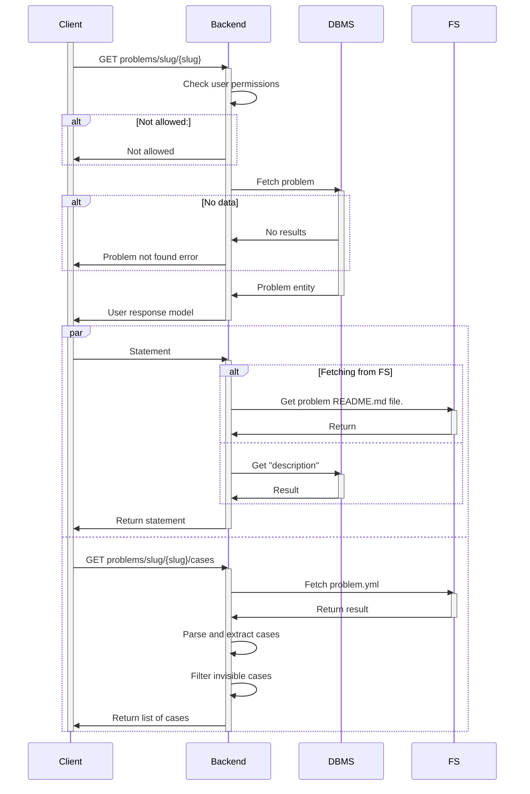

```mermaid
sequenceDiagram
    participant Client
    participant Backend
    participant DBMS

    activate Client
    Client->>Backend: GET  problems/slug/{slug}
    activate Backend
    Backend->>Backend: Check user permissions

    alt Not allowed:
        Backend->>Client: Not allowed
    end
Backend->>DBMS: Fetch problem
    activate DBMS
    alt No data
        DBMS->>Backend: No results
        Backend->>Client: Problem not found error
    end

    DBMS->>Backend: Problem entity
    deactivate DBMS
    Backend->>Client: User response model
    deactivate Backend


    par
        Client->>Backend: Statement
        activate Backend

        alt Fetching from FS
            Backend->>FS: Get problem README.md file.
            activate FS
            FS->>Backend: Return
            deactivate FS
        else
            Backend->>DBMS: Get "description" 
            activate DBMS
            DBMS->>Backend: Result
            deactivate DBMS
        end
        Backend->>Client: Return statement
        deactivate Backend
    and

        Client->>Backend: GET problems/slug/{slug}/cases
        activate Backend
        Backend->>FS: Fetch problem.yml
        activate FS
        FS->>Backend: Return result
        deactivate FS
        Backend->>Backend: Parse and extract cases
        Backend->>Backend: Filter invisible cases
        Backend->>Client: Return list of cases
    end
deactivate Backend
deactivate Client
```