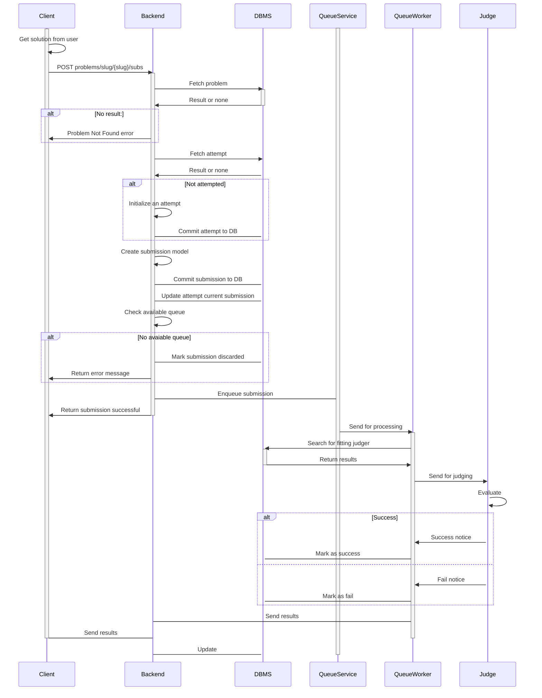

```mermaid
sequenceDiagram
    participant Client
    participant Backend
    participant DBMS
    participant QueueService
    participant QueueWorker
    participant Judge

    activate QueueService
    activate Client
    Client->>Client: Get solution from user

    Client->>Backend: POST problems/slug/{slug}/subs
    activate Backend

    Backend->>DBMS: Fetch problem
    activate DBMS
    DBMS->>Backend: Result or none
    deactivate DBMS

    alt No result:
        Backend->>Client: Problem Not Found error
    end

    Backend->>DBMS: Fetch attempt
    activate DBMS
    DBMS->>Backend: Result or none

    alt Not attempted
        Backend->>Backend: Initialize an attempt
        Backend->DBMS: Commit attempt to DB
    end

    Backend->>Backend: Create submission model
    Backend->DBMS: Commit submission to DB
    Backend->DBMS: Update attempt current submission

    Backend->>Backend: Check available queue

    alt No avaiable queue
        Backend->DBMS: Mark submission discarded
        Backend->>Client: Return error message
    end

    Backend->QueueService: Enqueue submission
    Backend->>Client: Return submission successful
    deactivate Backend

    QueueService->>QueueWorker: Send for processing
    activate QueueWorker
    QueueWorker->>DBMS: Search for fitting judger
    activate DBMS
    DBMS->>QueueWorker: Return results
    deactivate DBMS
    QueueWorker->>Judge: Send for judging
    activate Judge
    Judge->>Judge: Evaluate

    alt Success
        Judge->>QueueWorker: Success notice
        QueueWorker->DBMS: Mark as success
    else
        Judge->>QueueWorker: Fail notice
        QueueWorker->DBMS: Mark as fail
    end
    QueueWorker->Backend: Send results
    Backend->Client: Send results

    deactivate QueueWorker
    deactivate Client

    Backend->DBMS: Update 
    deactivate QueueService
```