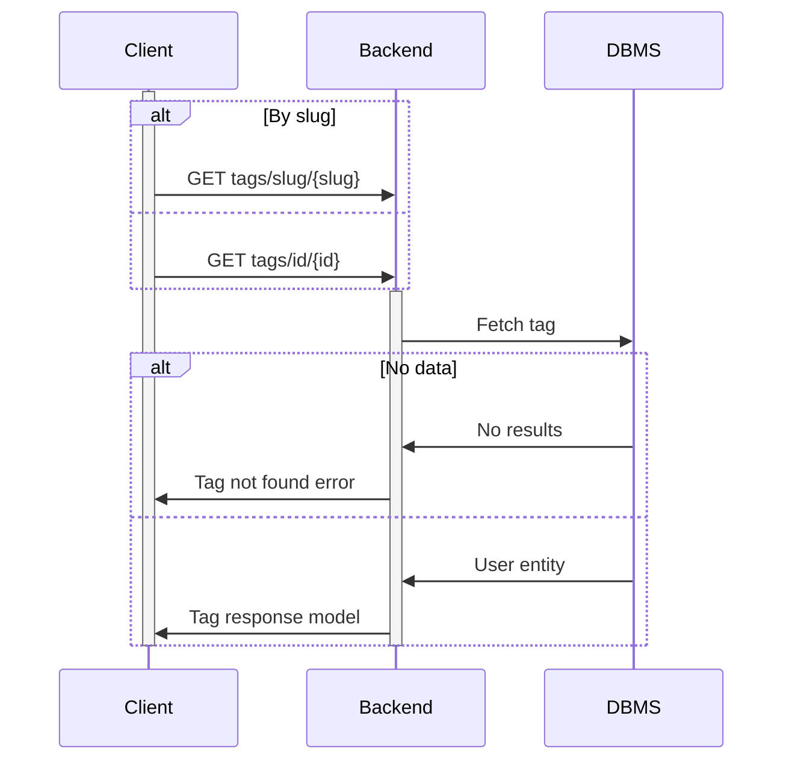

```mermaid
sequenceDiagram
    participant Client
    participant Backend
    participant DBMS

    activate Client
    alt By slug
        Client->>Backend: GET tags/slug/{slug}
    else
        Client->>Backend: GET tags/id/{id}
    end

    activate Backend
    Backend->>DBMS: Fetch tag
    alt No data
        DBMS->>Backend: No results
        Backend->>Client: Tag not found error
    else
        DBMS->>Backend: User entity
        Backend->>Client: Tag response model
    end
    deactivate Backend
    deactivate Client
```