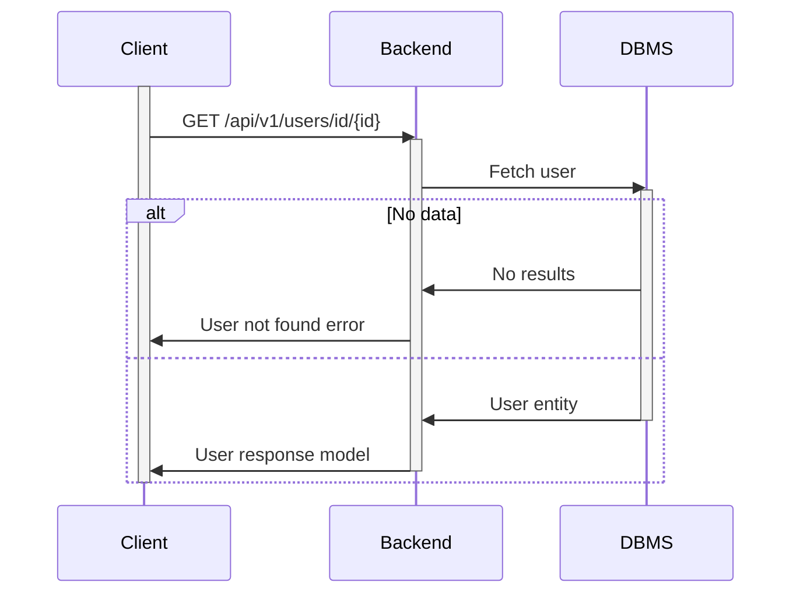

```mermaid
sequenceDiagram
    participant Client
    participant Backend
    participant DBMS

    activate Client
    Client->>Backend: GET /api/v1/users/id/{id}
    activate Backend
    Backend->>DBMS: Fetch user
    activate DBMS
    alt No data
        DBMS->>Backend: No results
        Backend->>Client: User not found error
    else
        DBMS->>Backend: User entity
        deactivate DBMS
        Backend->>Client: User response model
        deactivate Backend
    end
    deactivate Client
```